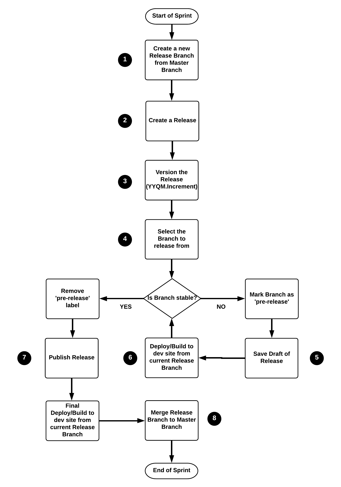

# Versioning Releases
Products can follow a date and process-based release version number format of `YYQM.S[-modifier]` explained in detail below.

```
What about SemVer?

Semantic Versioning makes great sense for software libraries that are used as dependencies.
For stand-alone applications, however, we prefer to use a system that actually conveys some information about the release.
```

## Versioning Workflow


#### Step 1: Create a new Release Branch from Master Branch
- At the start of a sprint, create a release branch for your repository from the master branch using Git. The naming convention for the branch could be based on the current sprint number. For example: “sprint-6”.

- Note that all feature branches can then be branched from this newly created release branch. All Pull Requests, once approved, should be merged back into the current release branch and not the master branch.

#### Step 2: Create a Release
- In GitHub, create a “Release” for each repository of the project. Note that you must have write access to your repositories to do this. [This article](https://help.github.com/articles/creating-releases) has further details.

#### Step 3: Version the Release
- While creating a “Release”, you will be asked for a version number. Version numbers should follow the numbering scheme defined by the NPI group using the end of sprint date with the following pattern: YYQM.increment.

For example, if we were to create a Beta release for the current sprint ending on Thursday, February 8th 2018, the version number would like this: ‘1812.1-beta’

Where ’18’ is the year, ‘1’ is the quarter, ‘2’ is the month in the quarter, ‘.1’ indicates it is the first release of the month and ‘-beta’ indicates this is a Beta release. This same convention can be followed for MVP release cycles as well, but appending ‘-mvp’ instead. For GA releases, you can leave the appended text off.

- Another example:
A Beta release version number for a Sprint ending Thursday, April 20, 2018 would look like this:
1821.2-beta

- Note that ‘.2’ indicates this was the second release in the month of April.

#### Step 4: Select the Branch to release from
- While still on the creating a Release page, you also want to select the branch (created in step 1) to release against, like ‘sprint-6’. If the branch is currently unstable (meaning still under active development), you can set it as a “pre-release” which obviously would be the case for the beginning of a development sprint. Note that once you are code-complete for the current sprint, the ‘pre-release’ label can be removed and will now be considered a stable branch ready for release. See step 7 below.

#### Step 5: Save as Draft
- Click “Save draft”.

#### Step 6: Deploy/Build to dev site from current Release Branch
- Now you can deploy/build to your dev site from the current Release branch. Note that if you are using a continuous integration server for your builds like CircleCI, make sure it is configured to build from the current release branch.

#### Step 7: Publish Release
- Once the sprint is code complete and all PR’s have been merged to the current release branch and is considered stable, you can remove the “pre-release’ label and click “Publish release”.

#### Step 8: Merge Release Branch to Master Branch
- Once all stories for the current sprint have been accepted, merge the release branch into the master branch. It is recommended to keep the release branch around in case there is ever a need to fallback to it.
